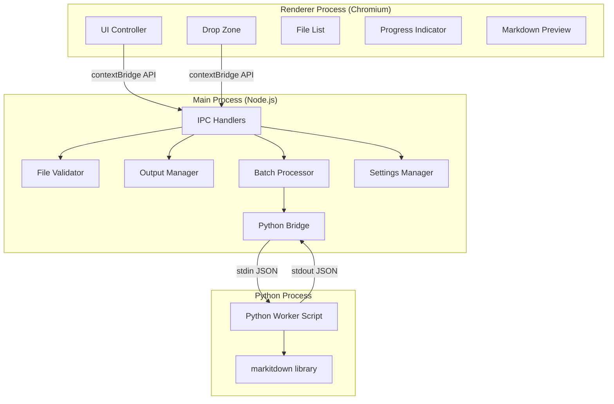
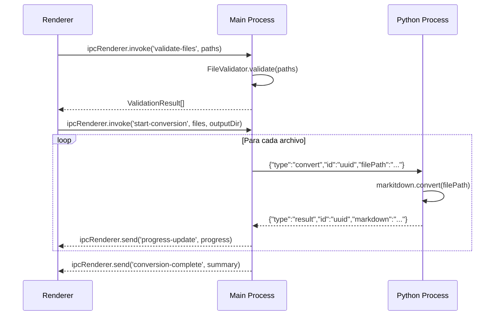

# Design Document: MarkItDown GUI

## Overview

MarkItDown GUI es una aplicación de escritorio construida con Electron que envuelve la librería [markitdown](https://github.com/microsoft/markitdown) de Microsoft en una interfaz gráfica. La aplicación permite convertir archivos de múltiples formatos (PDF, Word, Excel, PowerPoint, imágenes, audio, HTML, CSV, JSON, etc.) a Markdown mediante drag-and-drop o selección de archivos.

La arquitectura se basa en:
- **Electron** como shell de escritorio (contextIsolation habilitado, nodeIntegration deshabilitado)
- **Electron Forge + Webpack** para build y empaquetado
- **Python embebido** (python-build-standalone de Astral) con markitdown instalado
- **Comunicación stdin/stdout JSON** entre Node.js (main process) y el proceso Python
- **Procesamiento secuencial** de archivos para evitar sobrecarga

### Decisiones de diseño clave

| Decisión | Alternativas consideradas | Justificación |
|----------|--------------------------|---------------|
| python-build-standalone | PyInstaller, sistema Python | Distribución portable, sin dependencias del sistema, soporta macOS universal binary y Windows x64 |
| stdin/stdout JSON (newline-delimited) | REST local, named pipes, python-shell npm | Más simple, sin dependencias de red, compatible cross-platform, bajo overhead |
| Procesamiento secuencial | Paralelo con pool | Simplicidad, menor uso de memoria, evita conflictos en markitdown |
| marked + DOMPurify para preview | markdown-it, showdown | marked es maduro, rápido, bien mantenido; DOMPurify previene XSS |
| file-type para MIME validation | mmmagic, mime-types | Basado en magic bytes reales, no en extensión; ESM puro, sin binarios nativos |

## Architecture



### Flujo de comunicación



### Estructura del proyecto

```
markitdown-gui/
├── src/
│   ├── main/
│   │   ├── main.js              # Entry point, BrowserWindow
│   │   ├── preload.js           # contextBridge API
│   │   ├── ipc-handlers.js      # IPC handler registration
│   │   ├── file-validator.js    # Extensión + MIME + tamaño + path traversal
│   │   ├── output-manager.js    # Gestión de rutas de salida + sufijos
│   │   ├── batch-processor.js   # Cola secuencial + progreso + cancelación
│   │   ├── python-bridge.js     # spawn + stdin/stdout JSON + timeout + restart
│   │   └── settings-manager.js  # Persistencia con electron-store
│   ├── renderer/
│   │   ├── index.html           # Shell HTML
│   │   ├── renderer.js          # Entry point renderer
│   │   ├── ui-controller.js     # Coordinación UI
│   │   ├── drag-drop.js         # Drag-and-drop handler
│   │   ├── file-list.js         # Renderizado lista de archivos
│   │   ├── progress.js          # Progress indicator
│   │   ├── markdown-preview.js  # Renderizado preview con marked + DOMPurify
│   │   └── styles.css           # Estilos
│   ├── shared/
│   │   └── constants.js         # Constantes compartidas
│   └── python/
│       └── worker.py            # Script worker que recibe comandos JSON
├── python-env/                   # Python embebido (excluido de git, empaquetado en build)
├── tests/
│   ├── main/
│   │   ├── file-validator.test.js
│   │   ├── output-manager.test.js
│   │   ├── python-bridge.test.js
│   │   └── batch-processor.test.js
│   └── property/
│       └── protocol.property.test.js
├── assets/
│   ├── icon.ico
│   ├── icon.png
│   └── icon.icns
├── forge.config.js
├── webpack.main.config.js
├── webpack.renderer.config.js
├── package.json
└── vitest.config.js
```

## Components and Interfaces

### 1. Python Bridge (`src/main/python-bridge.js`)

Gestiona el ciclo de vida del proceso Python y la comunicación mediante JSON delimitado por newline.

```javascript
class PythonBridge {
  /**
   * Inicia el proceso Python embebido.
   * Busca el ejecutable en la ruta esperada según plataforma.
   * @returns {Promise<void>}
   * @throws {PythonBridgeError} si el ejecutable no existe o no responde en 10s
   */
  async initialize()

  /**
   * Envía un comando de conversión y espera la respuesta.
   * @param {string} filePath - Ruta absoluta del archivo a convertir
   * @param {string} requestId - UUID identificador de la solicitud
   * @returns {Promise<ConversionResult>}
   * @throws {TimeoutError} si excede 120 segundos
   * @throws {ProcessError} si el proceso Python muere
   */
  async convert(filePath, requestId)

  /**
   * Envía un comando de prueba para verificar disponibilidad.
   * @returns {Promise<boolean>}
   */
  async healthCheck()

  /**
   * Reinicia el proceso Python tras un crash.
   * @returns {Promise<void>}
   */
  async restart()

  /**
   * Termina el proceso Python de forma limpia.
   */
  async shutdown()
}
```

**Protocolo JSON (stdin → Python):**
```json
{"type": "convert", "id": "uuid-v4", "filePath": "/absolute/path/to/file.pdf"}
{"type": "health", "id": "uuid-v4"}
{"type": "shutdown", "id": "uuid-v4"}
```

**Protocolo JSON (stdout ← Python):**
```json
{"type": "result", "id": "uuid-v4", "success": true, "markdown": "# Content..."}
{"type": "result", "id": "uuid-v4", "success": false, "error": "Error message"}
{"type": "health", "id": "uuid-v4", "status": "ok", "version": "0.1.0"}
```

### 2. File Validator (`src/main/file-validator.js`)

Valida archivos antes de agregarlos a la cola de conversión.

```javascript
class FileValidator {
  /**
   * Valida un conjunto de rutas de archivo.
   * @param {string[]} filePaths - Rutas a validar
   * @param {string[]} existingPaths - Rutas ya presentes (para detectar duplicados)
   * @returns {Promise<ValidationResult[]>}
   */
  async validate(filePaths, existingPaths)

  /**
   * Verifica extensión contra la lista de formatos soportados.
   * @param {string} filePath
   * @returns {boolean}
   */
  isSupportedExtension(filePath)

  /**
   * Detecta el tipo MIME real mediante magic bytes.
   * @param {string} filePath
   * @returns {Promise<{mime: string, ext: string} | null>}
   */
  async detectMimeType(filePath)

  /**
   * Valida que el MIME detectado corresponda a la extensión.
   * @param {string} filePath
   * @returns {Promise<{valid: boolean, detectedMime?: string}>}
   */
  async validateMimeMatch(filePath)

  /**
   * Detecta secuencias de path traversal.
   * @param {string} filePath
   * @returns {boolean}
   */
  hasPathTraversal(filePath)

  /**
   * Verifica que el tamaño no exceda 500 MB.
   * @param {string} filePath
   * @returns {Promise<boolean>}
   */
  async isWithinSizeLimit(filePath)
}
```

### 3. Output Manager (`src/main/output-manager.js`)

Gestiona la determinación de rutas de salida y resolución de conflictos de nombres.

```javascript
class OutputManager {
  /**
   * Determina la ruta de salida para un archivo convertido.
   * @param {string} inputFilePath - Ruta del archivo original
   * @param {string|null} customOutputDir - Directorio personalizado (null = usar directorio original)
   * @returns {Promise<string>} Ruta completa del archivo .md de salida
   * @throws {OutputError} si se alcanza el límite de 99 sufijos
   */
  async resolveOutputPath(inputFilePath, customOutputDir)

  /**
   * Verifica que el directorio de salida tenga permisos de escritura.
   * @param {string} dirPath
   * @returns {Promise<boolean>}
   */
  async isWritable(dirPath)

  /**
   * Escribe contenido markdown a la ruta determinada.
   * @param {string} outputPath - Ruta de destino
   * @param {string} content - Contenido markdown
   * @returns {Promise<void>}
   */
  async writeOutput(outputPath, content)
}
```

### 4. Batch Processor (`src/main/batch-processor.js`)

Orquesta la conversión secuencial de múltiples archivos con soporte de cancelación y reporte de progreso.

```javascript
class BatchProcessor {
  /**
   * Inicia la conversión secuencial de archivos.
   * @param {FileItem[]} files - Archivos a convertir
   * @param {string|null} outputDir - Directorio de salida
   * @param {function} onProgress - Callback de progreso
   * @returns {Promise<BatchResult>}
   */
  async process(files, outputDir, onProgress)

  /**
   * Cancela la conversión después del archivo actual.
   */
  cancel()

  /**
   * Indica si hay una conversión en progreso.
   * @returns {boolean}
   */
  isProcessing()
}
```

### 5. Settings Manager (`src/main/settings-manager.js`)

Persiste preferencias del usuario entre sesiones usando `electron-store`.

```javascript
class SettingsManager {
  /**
   * Obtiene el directorio de salida personalizado.
   * @returns {string|null}
   */
  getOutputDir()

  /**
   * Establece el directorio de salida personalizado.
   * @param {string|null} dirPath
   */
  setOutputDir(dirPath)
}
```

### 6. Preload API (`src/main/preload.js`)

Expone una API segura al renderer mediante contextBridge:

```javascript
contextBridge.exposeInMainWorld('markitdownAPI', {
  // File operations
  openFileDialog: () => ipcRenderer.invoke('open-file-dialog'),
  validateFiles: (paths, existing) => ipcRenderer.invoke('validate-files', paths, existing),
  extractFolderFiles: (folderPath) => ipcRenderer.invoke('extract-folder-files', folderPath),

  // Conversion
  startConversion: (files, outputDir) => ipcRenderer.invoke('start-conversion', files, outputDir),
  cancelConversion: () => ipcRenderer.invoke('cancel-conversion'),

  // Output
  selectOutputDir: () => ipcRenderer.invoke('select-output-dir'),
  getOutputDir: () => ipcRenderer.invoke('get-output-dir'),
  openOutputFolder: (dirPath) => ipcRenderer.invoke('open-output-folder', dirPath),

  // Preview
  readMarkdownFile: (filePath) => ipcRenderer.invoke('read-markdown-file', filePath),
  copyToClipboard: (text) => ipcRenderer.invoke('copy-to-clipboard', text),

  // Events
  onProgressUpdate: (cb) => ipcRenderer.on('progress-update', (_, data) => cb(data)),
  onConversionComplete: (cb) => ipcRenderer.on('conversion-complete', (_, data) => cb(data)),
  onConversionError: (cb) => ipcRenderer.on('conversion-error', (_, data) => cb(data)),

  // Cleanup
  removeAllListeners: (channel) => ipcRenderer.removeAllListeners(channel),
})
```

### 7. Python Worker (`src/python/worker.py`)

Script Python que ejecuta markitdown y se comunica por stdin/stdout:

```python
# Lectura continua de stdin, una línea JSON por comando
# Responde en stdout con JSON delimitado por newline
# Maneja: convert, health, shutdown
# Redirige stderr para evitar contaminar stdout
```

## Data Models

### Tipos compartidos (TypeScript-style documentation para JS)

```javascript
/**
 * @typedef {Object} FileItem
 * @property {string} path - Ruta absoluta del archivo
 * @property {string} name - Nombre del archivo (basename)
 * @property {string} extension - Extensión sin punto
 * @property {number} size - Tamaño en bytes
 * @property {'pending'|'converting'|'done'|'error'|'cancelled'} status
 */

/**
 * @typedef {Object} ValidationResult
 * @property {string} path - Ruta del archivo validado
 * @property {string} fileName - Nombre del archivo
 * @property {boolean} valid - Si pasó todas las validaciones
 * @property {string} [error] - Código de error: 'unsupported_extension' | 'mime_mismatch' |
 *   'path_traversal' | 'too_large' | 'duplicate' | 'unreadable'
 * @property {number} [fileSize] - Tamaño en bytes (si se pudo leer)
 * @property {string} [detectedMime] - MIME detectado (si hubo mismatch)
 */

/**
 * @typedef {Object} ConversionResult
 * @property {string} id - Request ID (UUID)
 * @property {boolean} success
 * @property {string} [markdown] - Contenido convertido (si success)
 * @property {string} [error] - Mensaje de error (si !success)
 * @property {string} [outputPath] - Ruta donde se guardó el .md
 */

/**
 * @typedef {Object} ProgressUpdate
 * @property {number} percentage - 0 a 100
 * @property {string} currentFile - Nombre del archivo en proceso
 * @property {number} currentIndex - Índice actual (1-based)
 * @property {number} totalFiles - Total de archivos
 */

/**
 * @typedef {Object} BatchResult
 * @property {number} successful - Cantidad de archivos convertidos
 * @property {number} failed - Cantidad de archivos que fallaron
 * @property {number} cancelled - Cantidad de archivos cancelados
 * @property {number} totalTimeMs - Tiempo total en milisegundos
 * @property {ConversionResult[]} results - Resultados individuales
 */

/**
 * @typedef {Object} BridgeCommand
 * @property {'convert'|'health'|'shutdown'} type
 * @property {string} id - UUID v4
 * @property {string} [filePath] - Ruta del archivo (solo para convert)
 */

/**
 * @typedef {Object} BridgeResponse
 * @property {'result'|'health'} type
 * @property {string} id - UUID correspondiente al comando
 * @property {boolean} [success] - Solo en type='result'
 * @property {string} [markdown] - Solo si success=true
 * @property {string} [error] - Solo si success=false
 * @property {string} [status] - Solo en type='health'
 * @property {string} [version] - Solo en type='health'
 */
```

### Mapeo extensión → MIME esperado

```javascript
const SUPPORTED_FORMATS = {
  // Documentos
  pdf: ['application/pdf'],
  docx: ['application/vnd.openxmlformats-officedocument.wordprocessingml.document'],
  pptx: ['application/vnd.openxmlformats-officedocument.presentationml.presentation'],
  xlsx: ['application/vnd.openxmlformats-officedocument.spreadsheetml.sheet'],
  xls: ['application/vnd.ms-excel'],
  // Web
  html: ['text/html'],
  htm: ['text/html'],
  // Datos
  csv: ['text/csv', 'text/plain'],
  json: ['application/json'],
  jsonl: ['application/json', 'text/plain'],
  xml: ['application/xml', 'text/xml'],
  rss: ['application/rss+xml', 'application/xml', 'text/xml'],
  atom: ['application/atom+xml', 'application/xml', 'text/xml'],
  // Texto
  txt: ['text/plain'],
  md: ['text/plain', 'text/markdown'],
  // Imágenes
  jpg: ['image/jpeg'],
  jpeg: ['image/jpeg'],
  png: ['image/png'],
  // Audio
  wav: ['audio/wav', 'audio/x-wav'],
  mp3: ['audio/mpeg'],
  m4a: ['audio/mp4', 'audio/x-m4a'],
  mp4: ['video/mp4'],
  // Otros
  epub: ['application/epub+zip'],
  ipynb: ['application/json'],
  msg: ['application/vnd.ms-outlook'],
  zip: ['application/zip'],
}
```

## Correctness Properties

*A property is a characteristic or behavior that should hold true across all valid executions of a system — essentially, a formal statement about what the system should do. Properties serve as the bridge between human-readable specifications and machine-verifiable correctness guarantees.*

### Property 1: JSON protocol round-trip

*For any* valid `BridgeCommand` object conforming to the protocol schema (with fields `type`, `id`, and optionally `filePath`), serializing it to a JSON string (newline-delimited) and then parsing it back SHALL produce an object with identical properties and values (deep equality).

**Validates: Requirements 5.4, 9.5**

### Property 2: File extension validation consistency

*For any* file path string, `isSupportedExtension` SHALL return `true` if and only if the file's extension (case-insensitive) is present in the `SUPPORTED_FORMATS` map.

**Validates: Requirements 1.2, 8.1**

### Property 3: Path traversal detection

*For any* file path string containing the sequences `../`, `..\`, or resolved absolute paths pointing outside the working scope, `hasPathTraversal` SHALL return `true`. Conversely, for any path that does not contain such sequences and resolves within allowed directories, it SHALL return `false`.

**Validates: Requirements 8.3**

### Property 4: Output filename suffix resolution

*For any* base filename and a set of existing files in the output directory, `resolveOutputPath` SHALL produce a filename that does not collide with any existing file, using incremental numeric suffixes `_1` through `_99`. The resulting filename SHALL always end in `.md`.

**Validates: Requirements 3.3, 3.4**

### Property 5: File size formatting

*For any* non-negative integer byte count, the formatting function SHALL produce a human-readable string in the form `X.Y KB`, `X.Y MB`, or `X.Y GB` (one decimal) where the unit is chosen so that X is between 0.1 and 999.9 when possible.

**Validates: Requirements 1.4**

### Property 6: Batch progress reporting

*For any* list of N files (where N ≥ 1), after processing the i-th file, the Batch Processor SHALL emit a progress update with `percentage` equal to `Math.round((i / N) * 100)`, `currentIndex` equal to `i`, and `totalFiles` equal to `N`.

**Validates: Requirements 2.3, 9.4**

### Property 7: Batch fault tolerance

*For any* list of files where some individual conversions fail (throw errors), the Batch Processor SHALL continue processing the remaining files and produce a `BatchResult` where `successful + failed + cancelled === totalFiles`.

**Validates: Requirements 2.6, 2.7, 9.4**

### Property 8: Duplicate path detection

*For any* set of file paths where some paths are absolute-path duplicates of already-imported files, the validation SHALL reject exactly the duplicate paths and accept all non-duplicate valid paths.

**Validates: Requirements 1.6**

## Error Handling

### Categorías de error

| Capa | Error | Acción |
|------|-------|--------|
| File Validator | Extensión no soportada | Notificación con formatos aceptados |
| File Validator | MIME mismatch | Notificación con extensión y MIME detectado |
| File Validator | Path traversal | Rechazo silencioso + notificación de ruta inválida |
| File Validator | Archivo > 500 MB | Notificación del límite de tamaño |
| Output Manager | Directorio sin permisos | Bloquear conversión + notificación |
| Output Manager | Límite 99 sufijos alcanzado | Error individual, continuar cola |
| Python Bridge | Ejecutable no encontrado | Mensaje con instrucciones de reinstalación |
| Python Bridge | Health check falla (10s) | Mensaje con causa específica |
| Python Bridge | Timeout 120s en conversión | Terminar proceso, reportar error, reiniciar |
| Python Bridge | Proceso muere inesperadamente | Reportar error, reiniciar para futuras conversiones |
| Batch Processor | Archivo individual falla | Registrar error, continuar siguiente |
| Batch Processor | Cancelación por usuario | Completar actual, detener cola, resumen parcial |
| Clipboard | Fallo al copiar | Notificación de error |

### Estrategia de notificaciones

- **Toast temporal (5s)**: Errores de validación individual, confirmaciones de copia
- **Persistente (dismiss manual)**: Errores críticos (Python no disponible, directorio sin permisos)
- **Lista en UI**: Errores durante conversión batch (acumulados en panel visible)

## Testing Strategy

### Framework y herramientas

- **Test runner**: Vitest (consistente con proyecto de referencia app-simon)
- **Property-based testing**: fast-check (ya usado en app-simon)
- **Coverage**: @vitest/coverage-v8, objetivo mínimo 80% en módulos core

### Enfoque dual

**Unit tests** (example-based):
- Escenarios específicos de validación (extensiones válidas/inválidas, MIME matches)
- Integración entre componentes (IPC handlers → validators)
- Edge cases: archivo vacío, nombre con caracteres especiales, directorio como entrada
- Errores del Python Bridge: timeout, crash, respuestas malformadas

**Property tests** (universally quantified):
- Round-trip del protocolo JSON (Property 1)
- Consistencia de validación de extensiones (Property 2)
- Detección de path traversal (Property 3)
- Resolución de sufijos sin colisiones (Property 4)
- Formateo de tamaño (Property 5)
- Progreso de batch (Property 6)
- Tolerancia a fallos del batch (Property 7)
- Detección de duplicados (Property 8)

### Configuración property tests

- Mínimo **100 iteraciones** por test de propiedad
- Cada test debe referenciar su propiedad de diseño con tag:
  - Formato: `Feature: markitdown-gui, Property {N}: {título}`
- Librería: `fast-check` versión ^4.x

### Cobertura objetivo

| Módulo | Cobertura mínima |
|--------|-----------------|
| file-validator.js | 80% |
| output-manager.js | 80% |
| python-bridge.js | 80% |
| batch-processor.js | 80% |

### Comando de ejecución

```bash
vitest run              # Todos los tests
vitest run --coverage   # Con reporte de cobertura
```
